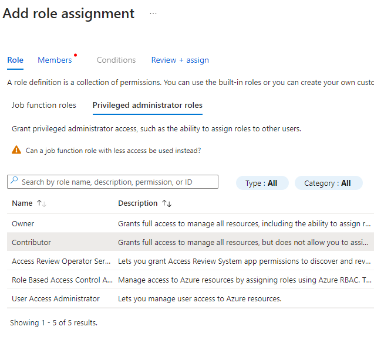
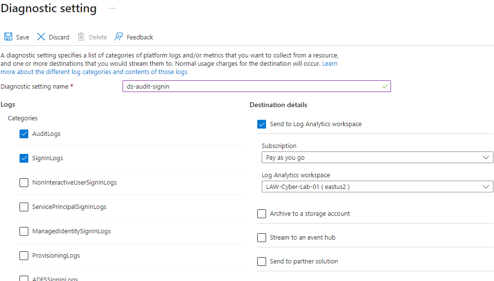
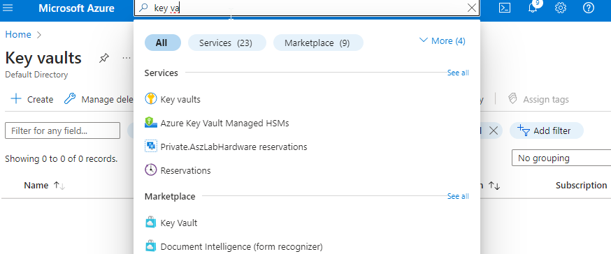
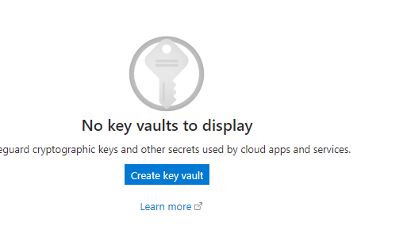
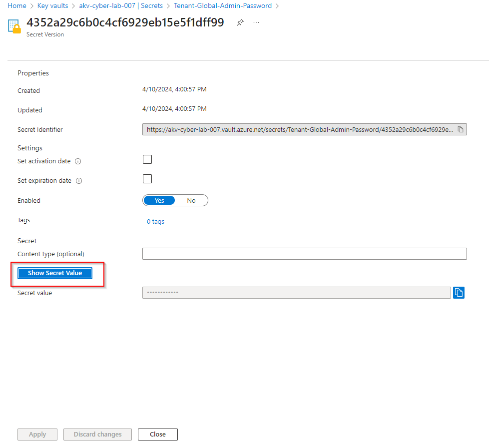
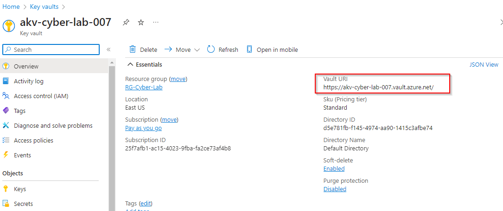

Honey Net Lab Steps with Screenshots.

# Contents
# Table of Contents
- [Creating First Resource](#creating-first-resource)
- [Installing MS SQL Server](#installing-ms-sql-server)
- [Precursor to Security Operations (Failed Auth, Log Observation)](#precursor-to-security-operations-failed-auth-log-observation)
- [Azure Active Directory (now renamed to Microsoft Entra ID)](https://github.com/Checkerss/Azure-Honey-Net-Lab/blob/master/tut.md#azure-active-directory-now-renamed-to-microsoft-entra-id-)
- [Logging and Monitoring](#logging-and-monitoring)
- [Enabling Microsoft Defender](#enabling-microsoft-defender)
- [Enable Log Collection for VMs and Network Security Groups](#enable-log-collection-for-vms-and-network-security-groups)
- [Kusto Query Language (KQL)](#kusto-query-language-kql)
- [Tenant Level Logging](#tenant-level-logging)
- [Next Will be doing Subscription Level Logging (Activity Log)](#next-will-be-doing-subscription-level-logging-activity-log)

# *<u>CREATING FIRST RESOURCE</u>*

**Step 1:** Create your Azure account using one of three options: free,
pay-as-you-go, or student. Choose whichever fits your needs. Once you
have done so, you will be redirected to the Azure home portal.

**Step 2: <u>Create Windows 10 Pro Virtual Machine (Name it
windows-vm)</u>**

- See all sizes, cheap-ish, strong password

- Region: EAST US 2

- Name the Resource Group: **<u>RG-Cyber-Lab</u>**

- Name the Virtual Network. **<u>NAME IT “Lab-VNet”</u>**

- **<u>Username: labuser</u>**

- **<u>Password: Cyberlab123!</u>**

  - Look over screenshots to make sure your lab is the same

>  style="width:5.1722in;height:3.64044in"
> alt="A screenshot of a computer Description automatically generated" />
>  style="width:4.91702in;height:5.26951in"
> alt="A screenshot of a computer Description automatically generated" />
>
>  alt="A screenshot of a computer Description automatically generated" />
>
> STEP 3: **Create one more Virtual Machine running <u>Ubuntu
> (Linux)</u>. Name <u>it: “Linux-vm”</u>**

- Same Region, Resource Group, and VNet as windows-vm

- Region: EAST US 2

- **Do not choose B1s for the VM size; choose something more
  significant, or it’ll get DDOS’d and stop creating logs, lol. I
  patched the video to convey this.**

- Ensure you use a username and password instead for authentication

**Open up Network Security Groups for both VMs:**

- Configure Network Security Group (Layer 4 Firewall) to allow
  **<u>all</u>** traffic inbound

>  style="width:3.9109in;height:3.34265in"
> alt="A screenshot of a computer Description automatically generated" />
>  style="width:3.9912in;height:3.77714in"
> alt="A screenshot of a computer Description automatically generated" />

- Find the NSG(network security groups) in the search bar, on the VM
  itself, or in the RG-Cyber_Lab group

>  alt="A screenshot of a computer Description automatically generated" />
>
>  style="width:6.58072in;height:3.35417in"
> alt="Delete the inbound rule for 22,click on add+ to add a new inbound rule allowing all traffic. The priority has to be below the other rules, so 110 or 100 work." />

Do the same for the Windows Network Security Group: delete the RDP port
and add a new rule to allow all traffic.

<u>Keep track of Cost management.</u>

# *<u>INSTALLING MS SQL SERVER</u>*

STEP 4: **<u>Disable Windows Firewall, and Install SQL Server, and
Create Vulnerabilities</u>**

- Remote Into the VM (windows-vm)

  - You can do this with a remote desktop if you are using a Windows PC
    or download an app for Mac OS or Windows. (Google is your friend)

  - 

- Turn off the Windows Firewall

  - 

- Install SQL Server Evaluation:
  [<u>https://www.microsoft.com/en-us/evalcenter/evaluate-sql-server-2019</u>](https://www.microsoft.com/en-us/evalcenter/evaluate-sql-server-2019)
  (inside windows VM)

- Put fake info. It works. Click on Download Media and put it on the
  desktop.

- 

- 

>  style="width:6.5in;height:2.98611in"
> alt="A screenshot of a computer Description automatically generated" />

- Right-click it and press mount

- Then you'll see in the image below it's now mounted, and click on
  setup to install the sql server onto the Windows VM.

>  style="width:6.5in;height:3.54931in"
> alt="A screenshot of a computer Description automatically generated" />

- Click on installation and the first option,

- Click next on everything to accept the license agreement

>  style="width:6.5in;height:4.87292in"
> alt="A screenshot of a computer Description automatically generated" />

- Click on database engine services and the next

>  alt="A screenshot of a computer Description automatically generated" />

- Next, until you get here, click on mixed mode and input a password. I
  used the same as the VMs. Add current User, also

- Continue and install. Don’t change anything else.

>  style="width:5.69968in;height:4.29546in"
> alt="A screenshot of a computer Description automatically generated" />
>
>  style="width:6.5in;height:4.70833in"
> alt="A screenshot of a computer Description automatically generated" />

- Username: sa (default)

- Password: Cyberlab123! 

<!-- -->

- Install SSMS (SQL Server Management Studio):
  [<u>https://learn.microsoft.com/en-us/sql/ssms/download-sql-server-management-studio-ssms</u>](https://learn.microsoft.com/en-us/sql/ssms/download-sql-server-management-studio-ssms) 

>  style="width:3.46833in;height:3.03547in"
> alt="A screenshot of a computer Description automatically generated" />

- Enable logging for SQL Server to be ported into Windows Event Viewer
  ([<u>Ref</u>](https://learn.microsoft.com/en-us/sql/relational-databases/security/auditing/write-sql-server-audit-events-to-the-security-log?view=sql-server-ver16))

- Open the Windows registry by searching on the Windows search box
  registry editor

>  style="width:6.5in;height:3.16458in"
> alt="A screenshot of a computer Description automatically generated" />
>
>  style="width:5.70883in;height:4.09202in"
> alt="A screenshot of a computer Description automatically generated" />

- Go to the specified path on the ref site. Right-click security and go
  to permissions. Then ADD NETWORK SERVICE and give it full control.

>  style="width:6.00885in;height:6.60057in"
> alt="A screenshot of a computer Description automatically generated" />

- Apply changes and click ok

>  style="width:4.75875in;height:4.65874in"
> alt="A screenshot of a computer screen Description automatically generated" />

- Scroll to the configure portion, open command line in the VM, and
  follow the steps

- Exit out everything now and, open SQL server management, and enter
  creds from before

- Make sure to trust the certificate box to trust the server login. Then
  Right-click on windows-vm and, click on properties, the security, and
  click on 3rd option under login auditing. And ok, after
  you're done.

- Right-click on the same windows-vm and restart the server

- Disconnect and reconnect with plug icons after restart and input a
  wrong password then cancel and exit once error is shown and open event
  viewer to make sure its being audited.

It looks to be working fine.

- Test SQL logging to make sure it’s working properly

**<u>Test ping and logging into Linux-vm via SSH</u>**

- Ping Linux-vm

- Login to Linux-vm

**We will use both VMs in the next video, but you can turn them off for
now if you want to save money.**

# *<u>PRECURSOR TO SECURITY OPERATIONS (FAILED AUTH, LOG OBSERVATION)</u>*

**Check your Subscription’s [<u>Cost
Analysis</u>](https://portal.azure.com/#view/Microsoft_Azure_CostManagement/Menu/~/costanalysis/openedBy/AzurePortal)!!!!**

**<u>Admin Mode (pretend you are normal admin):</u>**

Create another Windows VM **<u>in a region outside the US and NAME IT
“attack-vm”</u>**

- Name the Resource Group RG-Cyber-Lab-Attacker

- Name the VNet Lab-VNet-Attacker

- It's the same as other VMs for space, or one CPU works also since
  Azure might not allow you to have more than two v2cpu VMs.

- Log into the VM to make sure it works

- Retrieve the public IP address of “windows-vm” from the Azure Portal
  save it for the next steps

**<u>Attacker Mode (pretend you are an attacker):</u>**

**<u>Generated some failed RDP logs against “windows-vm.”</u>**

From within of “attack-vm,” attempt to RDP into “windows-vm” **<u>with
the wrong credentials.</u>**

Repeat this step 2 more times with the wrong username and password.

**<u>Generated some failed MS SQL Auth logs against “windows-vm.”</u>**

Still within “attack-vm,” install SSMS if not already installed

Attempt to connect to the SQL Server on “windows-vm” with a wrong
password

**<u>Generated some failed SSH logs against “Linux-vm”</u>**

Still within “attack-vm,” attempt to SSH into “Linux-vm” with the wrong
credentials.

Log out of “attack-vm” now you are back to your computer.

You can shut down attack-vm for now.

**<u>Admin Mode (pretend you are normal admin):</u>**

From your computer, RDP back into “windows-vm.”

Inspect the failures and successes (Security Log for RDP, Application
Log for SQL)

Take note of the EventIDs, messaging, Source IP Addresses, etc.

You can also filter event ID 4625 and see who else has been trying to
get into your VM.

Next Image shows the application logs witch is the SQL server.

SSH into the Linux VM and observe the logs with the following commands:

cat /var/log/auth.log \| grep password

cat /var/log/auth.log \| grep Accepted

**TURN VMs OFF! (do not need for next STEPS)**

# *<u>Azure Active Directory (now renamed to Microsoft Entra ID )</u>*

# *<u>Overview – Users, Groups, and Access Management</u>*

**Check your Subscription’s [<u>Cost
Analysis</u>](https://portal.azure.com/#view/Microsoft_Azure_CostManagement/Menu/~/costanalysis/openedBy/AzurePortal)**

**<u>Configure and Observe Tenant-Level Global Reader</u>**

Create a user within Azure Active Directory (AAD) **(username:
globalreaderjohn)**

- Assign Tenant-Level Global Reader

- In a new browser/incognito, log in as **globalreaderjohn** and observe
  the result of being a Tenant Level “Global Reader.”

- Close browser/incognito when satisfied

**<u>Configure and Observer Subscription Reader</u>**

Back in the main browser, create another user within AAD ** (username:
subreaderjane)**

- Assign Subscription-Level Reader By going into the search bar in the
  portal and searching subscriptions. Yours will have a different name.

>  style="width:5.12544in;height:4.42538in"
> alt="A screenshot of a computer Description automatically generated" />
>
>  style="width:4.53373in;height:7.47565in"
> alt="A screenshot of a computer Description automatically generated" />
>
>  style="width:6.5in;height:7.07569in"
> alt="A screenshot of a computer Description automatically generated" />

- In a new browser/incognito, log in as **subreaderjane** and observe
  the result of being a Subscription Level “Global Reader.”

- Close browser/incognito when satisfied

**<u>Configure and Observe Resource Group Contributor (like an
admin)</u>**

Back in the main browser, create another user within AAD ** (username:
rgcontributordave)**

- Create a new resource group called “Permissions-Tester.”

>  style="width:6.29221in;height:3.49197in"
> alt="A screenshot of a computer Description automatically generated" />

- Assign Resource Group-level Contributor

  - Click on permission group, then access control, and add role
    assignment.

>  style="width:5.30879in;height:4.83375in"
> alt="A screenshot of a computer Description automatically generated" />
>
>  style="width:6.5in;height:3.33194in"
> alt="A screenshot of a computer Description automatically generated" />

- For our resource group (Permission-Tester), assign Contributor
  Permissions

- In a new browser/incognito, log in as **rgcontributordave** and
  Observe the result of being a Resource Group Level Contributor.

- You can only add resources with contributors to assigned resource
  groups.

# *<u>Logging and Monitoring</u>*

**<u>Do you need your VMs to be on for this lab?</u>**

**NO**

**<u>Put Large Geo-Data Files in Azure Storage</u>**

Download this file onto your PC:

- [<u>https://github.com/joshmadakor1/Cyber-Course-v2/blob/main/Sentinel-Maps(JSON)/geoip-summarized.csv</u>](https://github.com/joshmadakor1/Cyber-Course-v2/blob/main/Sentinel-Maps(JSON)/geoip-summarized.csv) 

>  style="width:6.5in;height:3.74236in"
> alt="A screenshot of a computer Description automatically generated" />

Create a Log Analytics Workspace (our log aggregator) named:
LAW-Cyber-Lab-0x

Setup Sentinel and connect it to our Log Analytics Workspace

**<u>DO NOT MESS THIS UP; FOLLOW NAMES AND EVERYTHING EXACTLY</u>**

<u>Create the GeoIP watchlist:</u>

Name/Alias: GeoIP

Source type: Local File

Number of lines before row: 0

Search Key: network

Allow time for these files to “upload”/load from your storage account
into Sentinel/Log Analytics Workspace. There are about **27k**
rows/records

Next, go to Log Analytics Workspace and make sure something comes out
when you query \_GetWatchlist("GeoIP")

It should look like this:

**Ensure the watchlist finishes uploading before moving to the next
lab.**

**We will use VMs in the next lab so that you can turn them on now or
before you begin the lab if you want to take a break.**

**<u>Enabling Microsoft
Defender</u>**

**<u>Do you need your VMs to be on for this lab?</u>**

**YES (windows-vm, Linux-vm)**

Enable Microsoft Defender for Cloud for Log Analytics Workspace

- Click on edit settings

- Enable Defender Plans for VMs and SQL Instances on VMs

- Enable Data Collection (All Events)

Enable Microsoft Defender for Cloud for Subscription

- Click on edit settings

- VMs, Storage Accounts, Key Vault, SQL Server

>  style="width:6.5in;height:4.80833in"
> alt="A screenshot of a computer Description automatically generated" />

- Go to settings in the server row afterward

>  style="width:6.5in;height:4.87778in"
> alt="A screenshot of a computer Description automatically generated" />

- Click on edit configuration and change to custom workspace to make
  sure it does not make its own workspace and logs from the actual VMS
  get sent to it.

>  style="width:6.5in;height:5.34861in"
> alt="A screenshot of a computer Description automatically generated" />

- Click Apply, then continue afterward, and then save

>  style="width:6.5in;height:5.14167in"
> alt="A screenshot of a computer Description automatically generated" />

- Make sure logs are being set to correct log analytics workspaces

Enable Microsoft Defender for Cloud Continuous Export in Environment
Settings

- Make sure to Export to the correct Log Analytics Workspace

- Do it for every single thing

>  style="width:6.5in;height:5.14583in"
> alt="A screenshot of a computer Description automatically generated" /> style="width:6.5in;height:5.01597in"
> alt="A screenshot of a computer Description automatically generated" />

Ensure MDC didn’t create another Log Analytics Workspace; delete it if
so.

We want to send everything to one Log Analytics Workspace for the sake
of the lab.

Looks good to continue!

**We will continue using the VMs in the next lab, so you can leave them
on unless you’re going to take a break.**

# *<u>Enable Log Collection for VMs and Network Security Groups</u>*

It's a bit of a long lab. Grab yourself a drink 🙂☕︎

Create an Azure Storage Account (sacyberlab0x, name needs to be unique)

- MUST be in the same region as VMs

>  style="width:6.5in;height:7.17083in"
> alt="A screenshot of a computer Description automatically generated" />
>
>  style="width:6.26721in;height:7.45065in"
> alt="A screenshot of a computer Description automatically generated" />

- This will be used to store the NSG Flow Logs, which we are about to
  create

Enable Flow logs for both Network Security Groups (NSGs)

Click on the windows-vm-nsg

Click on nsg flow logs.

Click on Create Flow log.

Click on select target resource and select network security group. That
way, you can enable a flow log for Linux vm at the same time. Should
redirect you if not click on resource afterwards.

Confirm selection.

- Make sure to send to our Log Analytics Workspace

- If there is no storage account listed, it means it’s in a different
  region from your VMs, so you’ll need to create another storage account
  in the same region

Click next Analytics make sure version 2 is clicked and enable traffic
analytics. Then click review+create and, look over everything, and
create.

Configure Data Collection Rules within our Log Analytics Workspace

Click on agents

Click on data collection rules.

Usually, it would say 0 Windows or Linux connected, but mine is
different. Regardless, continue with the steps.

- Turn on VMs if they aren’t already on

- Configure Linux Data Sources (auth only)

  - Linux-vm-logs

- Configure Windows Data Sources (Application (information only),
  Security (All))

  - Windows-vm-logs

Hit next. And add resources Linux and windows vm from rg cyber group.

Hit next, and we will add data sources to the logs that will be logged
from the VMs.

- Select Linux, click only on LOG-AUTH, and leave at debug, which means
  collect everything. Click none for the rest of the options.

Hit next at the bottom to add the data source.

Next, add more data sources next is windows event logs.

Click on next and add the same destination. Then, review and create.

Then, go back to the log analytics workspace. Click on the cyber lab,
then agents 🡪 data collection rules 🡪 Dcr-allvms.

Click on data sources.

- Configure Special Windows Event Data Collection (Defender and Windows
  Firewall)

  - [<u>https://github.com/joshmadakor1/Cyber-Course-v2/blob/main/Special-Windows-Event-Data-Collection-Rules/Rules.txt</u>](https://github.com/joshmadakor1/Cyber-Course-v2/blob/main/Special-Windows-Event-Data-Collection-Rules/Rules.txt) 

Click on Windows and, change basic to custom, and input these rules.

// Windows Defender Malware Detection XPath Query

- Microsoft-Windows-Windows
  Defender/Operational!\*\[System\[(EventID=1116 or EventID=1117)\]\]

// Windows Firewall Tampering Detection XPath Query

- Microsoft-Windows-Windows Firewall With Advanced
  Security/Firewall!\*\[System\[(EventID=2003)\]\]

>  style="width:6.5in;height:5.36458in"
> alt="A screenshot of a computer Description automatically generated" />
>
> Save and go back to check to make sure everything is applied
> correctly.

Manually install the Log Analytics Agent on both Windows VM and Linux
VM.

Go back to log analytics and into the cyber lab and agents tab. Click on
log analytics instructions.

You will log into the Windows VM, use the codes in your log analytics
workspace, and point back to the log analytics workspace to forward
them. This is just an extra precaution.

Once you are in your Windows VM, copy the link for the download agent
and paste it into your VM. The Internet browser should automatically
download the installation and start it by following the prompts. Have
your ID and key ready. If its already installed remove (I did) and
reinstall with steps above and below.

Next, all the way to install and finish the installation.

Go to the control panel, change the categories to large icons, and click
on Microsoft Monitoring Agent. Then click on Azure log analytics; it
should look like mine.

Now, let's do Linux. SSH into your Linux VM and copy and paste the log
analytics instructions. It will do it all for you and should have a 0
error at the end. That’s it nothing else needs to be done move onto the
next steps.

**Keep checking / refreshing the Log Analytics agents tab and ensure the
VMs show up there**

**Begin querying Log Analytics for logs from the VMs and NSGs; do not
move on from this lab until you see logs from all three sources or at
least the Linux/windows logs:**

- **Syslog (Linux):**

- **SecurityEvent (windows)**

- **AzureNetworkAnalytics_CL (Network Security Groups/NSGs)**

Linux

Windows:

NSGs:

When the logs are coming in, test generating a couple of logs (failed
logons for Windows/Linux) and observe them in Log Analytics

\*note\* Make sure to give it time if one or the other VM is not
producing logs.

\- make sure the NSG flow interval is 10 min, not the 1hr default

\- make sure to add the VMs to resources if not done on its own.

\- manually add the agents to the VMs to really be sure they are on
there

\- make sure syslog is running on linux VMs

Visual Recap: [<u>Logging and Monitoring: Enable MDC and Configure Log
Collection for Virtual
Machines</u>](https://docs.google.com/presentation/d/1Sd71Zm_J8PY06L3_YzoOpvctenhFFxJe9wB_OwA-MVk/edit#slide=id.g2191f5eb6b4_0_0)

**As long as you see logs coming in, you can shut down your Virtual
Machines to save money.**

# *<u>Kusto Query Language (KQL)</u>*

<https://github.com/joshmadakor1/Cyber-Course/blob/main/KQL-Query-Cheat-Sheet.md>

# *<u>Tenant Level Logging</u>*

**<u>Do you need your VMs to be on for this lab?</u>**

**NO (All VMs)**

**Check your Subscription’s [<u>Cost
Analysis</u>](https://portal.azure.com/#view/Microsoft_Azure_CostManagement/Menu/~/costanalysis/openedBy/AzurePortal)**

**<u>Admin Mode (pretend you are normal admin):</u>**

**<u>Setup logging for Azure Active Directory (aka Microsoft Entra ID)
and generate some logs</u>**

Create Diagnostic Settings to ingest Azure AD Logs

- Enable Audit Logs and Signin Logs for Azure AD

Check Log Analytics Workspace that the tables have been created:
“AuditLogs” “SigninLogs”

You can also check on the logs tab and see if the table has been created
if it doesn’t show up on tables section. If It wasn’t created it’d have
a red error message so it’s there in the image below just has not gotten
any logs yet. 

Create a dummy user, username “dummy_user”

Log in with it once (incognito window)

Assign dummy_user the Role of Global Administrator

Back in Active Directory.

Delete dummy_user

Observe Audit Logs logs in Log Analytics Workspace.

Rebuild/understand this query (Note: Some people’s tenant Global
Administrator can show up as either Company Administrator or “Global
Administrator.” Microsoft did this for some reason):

AuditLogs

\| where OperationName == "Add member to role" and Result == "success"

\| where TargetResources\[0\].modifiedProperties\[1\].newValue ==
'"Global Administrator"' or
TargetResources\[0\].modifiedProperties\[1\].newValue == '"Company
Administrator"' 

\| order by TimeGenerated desc

\| project TimeGenerated, OperationName, AssignedRole =
TargetResources\[0\].modifiedProperties\[1\].newValue, Status = Result,
TargetResources

**<u>Attacker Mode (pretend you are an attacker):</u>**

**<u>Simulate Brute Force Attack against Azure Active Directory (aka
Microsoft Entra ID)</u>**

Create the “attacker” user if it does not exist already

- Produce 10-11 failed Logins with the portal in incognito mode

- 

**<u>Admin Mode (pretend you are normal admin):</u>**

Observe SigninLogs in Log Analytics Workspace. It may take a while; give
it time.

Rebuild/understand this query:

SigninLogs

\| where ResultDescription == "Invalid username or password or Invalid
on-premise username or password."

\| extend location = parse_json(LocationDetails)

\| extend City = location.city, State = location.state, Country =
location.countryOrRegion, Latitude = location.geoCoordinates.latitude,
Longitude = location.geoCoordinates.longitude

\| project TimeGenerated, ResultDescription, UserPrincipalName,
AppDisplayName, IPAddress, IPAddressFromResourceProvider, City, State,
Country, Latitude, Longitude

**We don’t need VMs for the next video, so leave/turn them off if you
want to save money.**

Global Administrator Break-Glass account in case your main one gets
locked out. Just for extra precaution.

**<u>Do you need your VMs to be on for this lab?</u>**

**NO (All VMs)**

Create a backup account in Azure Active Directory (aka Microsoft Entra
ID) and assign it Global Administrator. 

Log into it once so you can change the password.

Make note of the Accounts login (UPN) and password (consider a password
manager)

**We don’t need VMs for the next video, so leave/turn them off if you
want to save money.**

# *<u>Next Will be doing Subscription Level Logging (Activity Log)</u>* 

#  

**<u>Do you need your VMs to be on for this lab?</u>**

**NO (All VMs)**

**Check your Subscription’s [<u>Cost
Analysis</u>](https://portal.azure.com/#view/Microsoft_Azure_CostManagement/Menu/~/costanalysis/openedBy/AzurePortal)**

Export Azure Activity Logs to Log Analytics Workspace

Create diagnostic setting

Generate some logs:

Create a new Resource Group named “Scratch-Resource-Group.”

Create another new Resource Group named
“Critical-Infrastructure-Wastewater.”

Delete both “Scratch-Resource-Group” and “Critical-Infrastructure” **(DO
NOT ACCIDENTALLY DELETE YOUR LAB RESOURCE GROUP)**

Test Lab Queries

// Querying for the deletion of critical Resource Groups

AzureActivity

\| where ResourceGroup starts with "Critical-Infrastructure-"

\| order by TimeGenerated

// Querying for changes to network security groups

AzureActivity

\| where OperationNameValue ==
"MICROSOFT.NETWORK/NETWORKSECURITYGROUPS/SECURITYRULES/WRITE"

// Optionally, specific Resource Groups:

// \| where ResourceGroup in ("resource-group-1", "resource-group-2") 

\| order by TimeGenerated

// Deletion activities within a certain timespan

AzureActivity

\| where OperationNameValue endswith "DELETE"

\| where ActivityStatusValue == "Success"

\| where TimeGenerated \> ago(30m)

\| order by TimeGenerated

// From Microsoft Defender for Cloud Security Events

AzureActivity

\| where CategoryValue == "Security"

// Just stuff happening on the Management Plane

AzureActivity

\| where CategoryValue != "Administrative"

**We don’t need VMs for the next video, so leave/turn them off if you
want to save money.**

# *<u>Resource Level Logging (Diagnostics settings)</u>*

**<u>Do you need your VMs to be on for this lab?</u>**

**NO (All VMs)**

**<u>Configure Logging for Azure Storage</u>**

Configure logging for your storage account by enabling diagnostic
settings for blob storage

- Collect All Logs and Metrics (metrics will record auth failures) and
  send to your Log Analytics Workspace instance

>  style="width:4.29204in;height:3.15861in"
> alt="A screenshot of a computer Description automatically generated" /> style="width:6.5in;height:3.04653in"
> alt="A screenshot of a computer Description automatically generated" />
>
>  style="width:6.5in;height:3.27986in" />
>
>  style="width:6.5in;height:3.81181in"
> alt="A screenshot of a computer Description automatically generated" />

**<u>Configure Logging for Key Vault</u>**

Create a Key Vault Instance

Configure logging for your Key Vault instance by enabling diagnostic
settings

- Collect the audit log and send to you Log Analytics Workspace instance

- Add a secret to Key Vault called “Tenant-Global-Admin-Password” with a
  made-up password

- Observe the key in key vault

>  style="width:6.5in;height:2.70694in"
> alt="A screenshot of a computer Description automatically generated" />
>
>  style="width:4.27537in;height:2.61689in"
> alt="A key in a circle with text Description automatically generated" />
>
>  style="width:6.31721in;height:7.08395in"
> alt="A screenshot of a computer screen Description automatically generated" />
>
>  style="width:5.17545in;height:7.20896in"
> alt="A screenshot of a computer Description automatically generated" />

Go to access policies In key vault that was created and make sure you
the user has all the proper access that is needed to generate logs.

Next lets create a secret.

Enable Diagnostic Settings in key vault

Create another secret just to make sure some logs are being generated.

Generate a test container in Storage account to create log as well.

Click on the test container and upload a dummy Txt file to generate
logs.

Generate some Logs for the Storage Account and Key Vault

- Generate some Logs for Azure Storage (read some blobs/files)

- Observe the Logs (they may take a moment to appear) -  [<u>KQL Query
  Cheat
  Sheet</u>](https://github.com/joshmadakor1/Cyber-Course/blob/main/KQL-Query-Cheat-Sheet.md)

**Storage Account Test Logs**

// Authorization Error

StorageBlobLogs 

\| where MetricResponseType endswith "Error" 

\| where StatusText == "AuthorizationPermissionMismatch"

\| order by TimeGenerated asc

// Reading a bunch of blobs

StorageBlobLogs

\| where OperationName == "GetBlob"

//Deleting a bunch of blobs (in a short time period)

StorageBlobLogs \| where OperationName == "DeleteBlob"

\| where TimeGenerated \> ago(24h)

//Putting a bunch of blobs (in a short time period) 

StorageBlobLogs \| where OperationName == "PutBlob"

\| where TimeGenerated \> ago(24h)

//Copying a bunch of blobs (in a short time period)

StorageBlobLogs \| where OperationName == "CopyBlob"

\| where TimeGenerated \> ago(24h)

**Key Vault Test Logs**

// List out Secrets

AzureDiagnostics

\| where ResourceProvider == "MICROSOFT.KEYVAULT"

\| where OperationName == "SecretList"

// Attempt to view passwords that don't exist

AzureDiagnostics

\| where ResourceProvider == "MICROSOFT.KEYVAULT"

\| where OperationName == "SecretGet"

\| where ResultSignature == "Not Found"

// Viewing an actual existing password

AzureDiagnostics

\| where ResourceProvider == "MICROSOFT.KEYVAULT"

\| where OperationName == "SecretGet"

\| where ResultSignature == "OK"

// Viewing a specific existing password

let CRITICAL_PASSWORD_NAME = "Tenant-Global-Admin-Password";

AzureDiagnostics

\| where ResourceProvider == "MICROSOFT.KEYVAULT"

\| where OperationName == "SecretGet"

\| where id_s contains CRITICAL_PASSWORD_NAME

// Updating a password Success

AzureDiagnostics

\| where ResourceProvider == "MICROSOFT.KEYVAULT" 

\| where OperationName == "SecretSet"

// Updating a specific existing password Success

let CRITICAL_PASSWORD_NAME = "Tenant-Global-Admin-Password";

AzureDiagnostics

\| where ResourceProvider == "MICROSOFT.KEYVAULT" 

\| where OperationName == "SecretSet"

\| where id_s endswith CRITICAL_PASSWORD_NAME

\| where TimeGenerated \> ago(2h)

// Failed access attempts

AzureDiagnostics

\| where ResourceProvider == "MICROSOFT.KEYVAULT" 

\| where ResultSignature == "Unauthorized"

**NOTE! In the next lab, we’re going to start onboarding logs to our
SIEM, so it may be a good idea to turn your VMs on now (both windows-vm
and linux-vm) and perhaps even let them run overnight to generate some
logs from people trying to break into them over the internet.**

# *<u>Microsoft Sentinel Build</u>*

**<u>Do you need your VMs to be on for this lab?</u>**

**YES (windows-vm, Linux-vm)**

Check your Subscription’s [Cost
Analysis](https://portal.azure.com/#view/Microsoft_Azure_CostManagement/Menu/~/costanalysis/openedBy/AzurePortal)

FYI:

We are going to create 4 different workbooks in Sentinel that show
different types of malicious traffic from around the world, targeting
our resources.

We will use pre-built JSON maps to reduce the number of
errors/questions, but will explain the process.

Normally making maps like this takes a lot of time and tweaking.

——————————————————————————————————————

Ref: [JSON
Files](https://github.com/joshmadakor1/Cyber-Course-V2/tree/main/Sentinel-Maps(JSON)) -
Remember, Sentinel uses our Log Analytics Workspace, where we ingested
the logs

- You can also just copy and paste the info into Microsoft Sentinel

- Maps is created in work books so click on workbooks and add workbook.

>  style="width:5.83883in;height:3.35421in"
> alt="A screenshot of a computer Description automatically generated" />Click
> on edit and remove the elements.
>
>  style="width:5.93933in;height:4.65565in"
> alt="A screenshot of a computer Description automatically generated" />

- Then click on add at the bottom. And click on query on the drop down.
  Then, on advanced editor.

>  style="width:5.74136in;height:4.62682in"
> alt="A screenshot of a computer Description automatically generated" />

Add the Linux files into it by copying and pasting. And click done
editing.

NOTE= geoip watchlist schema aka the column names have to match the json
files to query correctly. Error may occure because of this difference in
the files.

Change Countryname and Cityname on Watchlist to not have a \_ Underscore
or change the json sentinel files to have the underscores.

Within Azure Sentinel, **<u>first observe the Data Connectors</u>**,
then do the following:

- Use **windows-rdp-auth-fail.json** to create the “<u>Windows RDP/SMB
  Authentication Failures</u>” map

- Use **Linux-ssh-auth-fail.json** to create the “<u>Linux SSH
  Authentication Failures</u>” map

- Use **MySQL-auth-fail.json** to create the “<u>MS SQL Server
  Authentication Failures</u>” map

- Use **nsg-malicious-allowed-in.json** to create the “<u>NSG Allowed
  Malicious Inbound Flows</u>” map

- Example of what it should look like below, and you can check the query
  that is being used by sentinel to output that data by clicking edit
  top right 🡪 edit bottom right and then copying and pasting that back
  into log analytics to check out more info.

Observe any pre-existing malicious attack traffic on these maps from the
Internet.

Ensure an appropriate time frame is being selected (30 days)

——————————————————————————————————————

**If it’s been 24 hours since you created the resources being tracked on
this map and you don’t see traffic to them, make sure of the
following:**

- First, generate traffic on your own to see if any logs show up

- Ensure both VMs are on

- Ensure Microsoft Defender for Cloud and the Data Collection Rules are
  configured correctly to collect logs from the VMs (from section:
  Logging and Monitoring: Enable MDC and Configure Log Collection for
  Virtual Machines)

- Ensure Logging is correctly configured for MS SQL Server (from
  section: Azure Intro: Creating our Subscription and First Resources)

- If NSG FLow Logs are empty, ensure they are configured correctly (from
  section: Logging and Monitoring: Enable MDC and Configure Log
  Collection for Virtual Machines)

- Alternatively, you can skip ahead to the “Azure Sentinel: Attack
  Traffic Generation” section to generate some traffic, but we need to
  make sure logging is configured correctly and showing up before that
  will work.

**We’re going to continue to work with logs from the VMs, so it may be a
good idea to leave your VMs on (unless you’re going to go to bed or
something and want to maximize your savings)**

# *<u>Manual Alert Creation</u>*

**<u>Do you need your VMs to be on for this lab?</u>**

**YES (windows-vm)**

**Check your Subscription’s [Cost
Analysis](https://portal.azure.com/#view/Microsoft_Azure_CostManagement/Menu/~/costanalysis/openedBy/AzurePortal)**

Within Azure Sentinel, browse to “Analytics” -\> “Active Rules”

- Manually create the “TEST: Brute Force ATTEMPT - Windows” Rule

- 

>  style="width:6.5in;height:8.81528in"
> alt="A screenshot of a computer Description automatically generated" /> style="width:6.5in;height:7.65486in"
> alt="A screenshot of a computer screen Description automatically generated" />
>  style="width:6.5in;height:8.00694in"
> alt="A screenshot of a computer Description automatically generated" />
>
>  style="width:6.5in;height:6.32292in"
> alt="A screenshot of a computer Description automatically generated" />
>
>  style="width:6.5in;height:6.90486in"
> alt="A screenshot of a computer Description automatically generated" />

- **SecurityEvent  
  \| where EventID == 4625  
  \| where TimeGenerated \> ago(60m)  
  \| summarize FailureCount = count() by AttackerIP = IpAddress,
  EventID, Activity, DestinationHostName = Computer  
  \| where FailureCount \>= 10**

<!-- -->

- Try to trigger it by logging into windows vm atleast ten times fail
  the login.

- Then look for it in incidents in sentienel and you can click on
  invistigate on lower right side panel. Gives a visual representation
  of the attack.

>  style="width:6.5in;height:2.98889in"
> alt="A screenshot of a computer Description automatically generated" />

- Delete the Rule when finished

**We’re going to continue to work with logs from the VMs, so it may be a
good idea to leave your VMs on (unless you’re going to go to bed or
something and want to maximize your savings)**

***<u>Automatic Alert
Import</u>***

**<u>Do you need your VMs to be on for this lab?</u>**

**YES (windows-vm, Linux-vm)**

Import all of our [Sentinel Analytics
Rules](https://github.com/joshmadakor1/Cyber-Course-V2/tree/main/Sentinel-Analytics-Rules)

Select the “CUSTOM: Brute Force SUCCESS - Windows” Alerts and “Edit” it:

Copy the query and fully inspect/dissect it in Log Analytics Workspace.

User [ChatGPT](https://chat.openai.com/chat) to understand the rule
further:

**(This even works on complicated queries such as “CUSTOM: Brute Force
SUCCESS - Azure Active Directory”)**

Do this for the remaining “CUSTOM” Analytics Rules. Make sure you
understand.

**<u>Note:</u>**

In the next section, we will generate traffic from “attack-vm” to
trigger some of these rules.

Many of them will be triggered on their own from live Internet traffic.

**We’re going to continue to work with logs from the VMs, so it may be a
good idea to leave your VMs on (unless you’re going to go to bed or
something and want to maximize your savings)**

# *<u>Understanding and Triggering Sentinel</u>*

**<u>Do you need your VMs to be on for this lab?</u>**

**YES (windows-vm, Linux-vm, attack-vm)**

**<u>When triggering an alert, you can go to Analytics in Sentinel, copy
the rule query, and put that into log analytics to see the results
quicker before they show up as an incident.</u>**

**<u>Trigger AAD Brute Force Success </u>**

- (from within attack-vm) Simulate brute force success against Azure AD
  with your attacker account:

  - In an incognito windows, open portal.azure.com and fail 10-11 logins
    in a row, followed by a successful login

    - Bonus points if you want to try with PowerShell:
      [AAD-Brute-Force-Success-Simulator.ps1](https://github.com/joshmadakor1/Cyber-Course-V2/edit/main/Attack-Scripts/AAD-Brute-Force-Success-Simulator.ps1)

**<u>Trigger MSSQL Brute Force Attempt </u>**

- (from within attack-vm) Open SSMS and simulate brute force attempt
  against your SQL Server by attempting to log into it 10-11 times

  - Possible to do with PowerShell, not required
    [SQL-Brute-Force-Simulator.ps1](https://github.com/joshmadakor1/Cyber-Course-V2/blob/main/Attack-Scripts/SQL-Brute-Force-Simulator.ps1)

**<u>Trigger Malware Outbreak</u>**

(from within windows-vm) Generate a Malware alert by using an EICAR file

- [Malware-Generator-EICAR.ps1](https://github.com/joshmadakor1/Cyber-Course/blob/main/Attack-Scripts/Malware-Generator-EICAR.ps1)
  **(Do from within Windows VM)**

  - (this can be done manually by creating a text file with the EICAR
    string in it)

You can also see the alerts within the windows VM just to get an overall
look of how its displayed on there. Sentinel query Windows for this info
and displays it in logs.

**<u>Trigger Possible Privilege Escalation (AKV Critical Credential
Retrieval or Update) </u>**

- Manually Read Key Vault Secret “Tenant-Global-Admin-Password” in the
  portal and observe the incidents

- 

>  style="width:6.5in;height:5.87569in"
> alt="A screenshot of a computer Description automatically generated" />
>
> This rule exists to be able to investigate why and who has looked at
> the secrets even if its within the organization.

**<u>Trigger Windows Host Firewall Tampering</u>**

- Manually Enable and Disable the windows-vm Firewall and observe the
  incidents

**<u>Trigger Excessive Password Resets</u>**

- Manually Trigger excessive password resets ([KQL-Cheat-Sheet.
  md](https://github.com/joshmadakor1/Cyber-Course-V2/blob/main/KQL-Query-Cheat-Sheet.md))
  and observe the incidents by resetting a users’ password in the portal
  10-11 times

  - Make a new user and just reset the password in the portal.

>  style="width:6.5in;height:2.69375in"
> alt="A screenshot of a computer Description automatically generated" />
>
>  style="width:6.5in;height:2.47569in"
> alt="A screenshot of a computer Description automatically generated" />

Optional: attempt to trigger the rest of the customs rules to make sure
they work

Note:

It does take a bit of time for the logs to show up in the Log Analytics
Workspace.

If you want to trigger Brute Force attempts for Linux and RDP, simply
fail logging into these several times, but I assume the internet is
doing a good job of that already.

**We’re going to continue to work with logs from the VMs, so it may be a
good idea to leave your VMs on (unless you’re going to go to bed or
something and want to maximize your savings)**

**However, you do not need the attack VM from this point, so feel free
to turn it off or delete it.**

# *<u>Run the Insecure Environment for 24hrs and Capture Analytics</u>*

Spreadsheet: [BEFORE AND
AFTER](https://docs.google.com/spreadsheets/d/1MWJuaa1OcYXojxhjwDH_gtEV3kDvrf2RPgRi10XcVQQ/edit#gid=0)

Make sure all of the following queries/tables return something:

- SecurityEvent

- Syslog

- SecurityAlert

- SecurityIncident

- AzureNetworkAnalytics_CL 

Let the environment sit for 24 hours as is.

When we come back, we will count all the alerts/etc that happened in the
last 24 hours.

Secure our environment.

Let it sit for another 24 hours, secure again.

Come back and count the alerts/etc, then make a comparison between the
two.

Incident 1 - Brute Force Success

Windows - Working incidents and incidents Response

**Check your Subscription’s [Cost
Analysis](https://portal.azure.com/#view/Microsoft_Azure_CostManagement/Menu/~/costanalysis/openedBy/AzurePortal)**

Work on the incidents being generated within Azure Sentinel in
accordance with the

NIST 800-61 Incident Management Lifecycle. Make use of the provided Pl.

**Step 1: Preparation**

- (We initiated this already by ingesting all of the logs into Log
  Analytics Workspace and Sentinel and configuring alert rules)

**Step 2: Detection & Analysis (You may have different
alerts/incidents)**

1.  Set Severity, Status, Owner

2.  View Full Details (New Experience)

>  style="width:6.5in;height:4.71319in"
> alt="A screenshot of a computer Description automatically generated" />

3.  Observe the Activity Log (for history of incident)

4.  Observe Entities and Incident Timelines (are they doing anything
    else?)

5.  “Investigate” the incident and continue trying to determine the
    scope

6.  Inspect the entities and see if there are any related events.

    1.  Below, we see the VM has other related incidents by the visual
        dotted lines.

The image below shows the vm has been part of a whole bunch of other
attacks.

> So, to clarify, the IP address is the attacker, the Windows icon is
> the victim, and the attached incidents are the attacks that have been
> done against it.

7.  Determine legitimacy of the incident (True Positive, False Positive,
    etc.)

    1.  You can do that by looking at the analytics rule just to query
        around and see what exactly was done.

    2.  Click on the articles and read to get a better idea

8.  If True Positive, continue, if False positive, close it out

    1.  

**Step 3: Containment, Eradication, and Recovery**

- Use the simple [Incident Response
  PlayBook](https://docs.google.com/document/d/1EQ5MzN95POLaRIMulYg3PIH3UGHtDNcGdkFvgOXyEXQ/edit)

- 

**Step 4: Document Findings/Info and Clouse out the Incident in
Sentinel**

I hardened the NSG of all the VMs. I put my IP so any other IP will be
denied.

Repeat these steps for all the other Incidents. This is a practice to
get an idea of what a SOC analyst does.

# *<u>Regulatory Compliance (Enable NIST 800-53) (New)</u>*

**Check your Subscription’s [Cost
Analysis](https://portal.azure.com/#view/Microsoft_Azure_CostManagement/Menu/~/costanalysis/openedBy/AzurePortal)**

Inspect MDC Secure Score
([Ref](https://learn.microsoft.com/en-us/microsoft-365/security/defender/microsoft-secure-score?view=o365-worldwide))

Inspect MDC Recommendations

ENABLE MDC Regulatory Compliance (this takes  a while to appear) 

- NIST 800-53
  ([Ref](https://csrc.nist.gov/projects/cprt/catalog#/cprt/framework/version/SP_800_53_5_1_0/home))
  (Slides Refresher: [NIST 800-53
  Slides](https://docs.google.com/presentation/d/1JeK0tJWWjHDwJ0_UZVHw5IqM0BLkbPC89yHSwFdY9jE/edit))
  Compare NIST site with MDC recommendations

>  style="width:4.02139in;height:8.93875in"
> alt="A screenshot of a computer Description automatically generated" />
>
>  style="width:5.58411in;height:4.03181in"
> alt="A screenshot of a computer Description automatically generated" />
>
>  style="width:6.5in;height:1.30833in"
> alt="A screenshot of a video Description automatically generated" />
>
>  style="width:6.5in;height:1.49236in"
> alt="A screenshot of a computer Description automatically generated" />

Go back to Microsoft Defender for cloud and click on regulatory
compliance to see that 800-53 security and privacy controls have been
implemented. IT MAY TAKE HOURS TO SHOW.

- In the next video, we will Implement SC-7 (this could potentially take
  forever to implement in real life due to CAB (change
  a<https://csrc.nist.gov/projects/cprt/catalog#/cprt/framework/version/SP_800_53_5_1_0/home>dvisory
  board) and change management meetings/testing, but we can just do it. 

Some good ideas for additional portfolio projects might be walkthroughs
on how to remediate some of the other findings from MDC Recommendations
or the NIST 800-53 Regulatory Compliance Policy 🙂.

For Example: How-To’s for enabling MFA in Azure, implementing Azure
Firewall, etc.

**You can leave your VMs off.**

# *<u>Azure Private Link- Firewall for Resources (NIST SC-7)</u>*

**<u>Do you need your VMs to be on for this lab?</u>**

**Yes (windows-vm)**

**p**

Inspect MDC Regulatory Compliance (Available and Implemented)

- NIST 800-53
  ([Ref](https://csrc.nist.gov/Projects/risk-management/sp800-53-controls/release-search#/families?version=5.1))

  - We will Implement SC-7, not all the options, just some of them.

Configure Azure Private Link and Firewall for your Azure Key Vault
instance

- Ensure you use the same region and VNet the rest of your VMs are in

Configure Azure Private Link and Firewall for your Azure Storage Account
instance

- Disable Public Access (you can only access from within your VMs now.)

  - This is done on the network tab as well as the Settings -\>
    configuration “Allow Blob public access → Disabled” as well

  - 

Make your settings look like mine. They need to be exact to be able to
satisfy the NIST 800-53 SC-& requirement.

Then, go into private endpoint connections and add a private endpoint.

Observe Network Watcher Topology for the region and resource group all
your stuff.

Observe the Key Vault and Storage Account Private Endpoints are there.

Wait 5 minutes (get coffee, etc)

Login to “windows-vm” and check the IP addresses of your Key Vault and
Storage Account instances.

They should be private addresses, indicating the resources have been
probably integrated into private VNet:

If you see a public IP address, either it’s not done propagating yet, or
it’s not configured correctly:

(The above example was done from my personal Mac over the internet, but
this is what it will look like when it’s not working–with the public IP
addresses)

Possible causes for this are your resources and VM are actually in
different Virtual Networks, or something is just not setup right.

The good news is, you don’t need to fix this for the rest of the lab, we
are just trying to lock down the environment. However, if you want to
fix it, you can try deleting the Private Endpoints/config and trying
again.

Now, I will add an NSG like in the diagram above for the subnet itself
since the resources were once available on the public Internet but are
now within its enclosed subnet.

Create it, and no rules need to be set. This is to show it's possible to
attach to a subnet. 

Now, you can look at the topology on network watchers to see the
connections. Make sure to click on the cross specifically to see the
layout I'm looking at.

After this, you can go into Microsoft Defenders for Cloud to check if
the compliance has been updated. There is a Waiting period for it to be
evaluated, so you may not see immediate changes.

**After this lab, we will let our environment run for 24 hours, so
ensure your Windows VM and Linux VM are on. The next day (24 hours
later), we will capture our statistics for the locked-down environment
for our portfolio!**

**After a Secure environment.**

***<u>Environment
Cleanup</u>***

**<u>Do you need your VMs to be on for this lab?</u>**

**NO**

Delete all resource groups (this will automatically delete all VMs, Data
Collection Rules, Diagnostic Settings, Network Security Groups, Virtual
Networks, etc.)

Go to Azure Active Directory (aka Microsoft Entra ID) and delete the
attacker accounts and any other accounts that are NOT your main account
or breakglass account.

Ensure diagnostic settings have been deleted within Azure Active
Directory (aka Microsoft Entra ID).

Go to Microsoft Defender for Cloud → Environment Settings and
de-provision the subscription and Log Analytics Workspace.

<u>Optional</u>: You can go to Regulatory Compliance in Microsoft
Defender for Cloud and “Delete” the NIST 800-53 policy.

This concludes the lab for making a Virtual honeynet. We have gone over
many policies, concepts, constraints, logging, hardening, analyzing, and
much more. Thanks for reading and following along. Stay updated with my
socials for upcoming news and projects.
